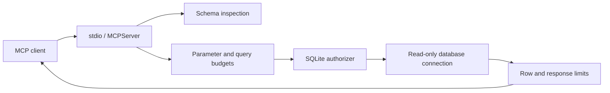

# MCP SQL Analytics

[](https://github.com/suprkco/mcp-sql-analytics/actions/workflows/ci.yml)

**A real MCP stdio server exposing bounded, read-only queries over synthetic retail data.**

## Problem

An assistant with SQL access should not receive unrestricted database privileges.
This prototype exposes schema inspection and one-query analytics with database-enforced guardrails and explicit resource limits.

## Demo

Run `python -m analytics.demo` after installing dependencies. [Recorded output](docs/demo.json) comes from 120 deterministic synthetic orders:

| Region | Revenue (cents) |
| --- | ---: |
| North | 50,000 |
| South | 250,000 |
| West | 120,000 |

The same demo attempts `DELETE FROM orders` and reports **blocked**. This is synthetic currency-denominated test data, not business performance. [Interview walkthrough](docs/interview.md).

## Architecture



## Tech stack

Python, the official MCP Python SDK v2, SQLite, pytest, and GitHub Actions. No LLM is required to run or test this tool server.

## Quickstart

The standalone demo is one command with Docker:

```sh
docker compose up --build
```

For a real MCP session:

```sh
python -m venv .venv
# Activate .venv, then:
pip install -r requirements.txt -r requirements-dev.txt
python -m analytics.seed
python -m analytics.server
```

The last command waits for MCP JSON-RPC on stdin; it is not a conversational terminal. Configure your MCP client's stdio transport to launch the environment's Python with `-m analytics.server`, working directory set to this repository, and `ANALYTICS_DB` pointing to the generated database. If your client cannot set a working directory, use `python -m analytics.server` with `PYTHONPATH` set to this repository's absolute path.

Tools: `inspect_schema()` and `query_readonly(sql, parameters)`. Example query:

```sql
SELECT region, SUM(revenue_cents) AS revenue_cents
FROM orders WHERE region = ? GROUP BY region
```

Use `["North"]` as the parameter list. The server never accepts a database path from a tool call. `.env.example` documents process configuration; no automatic dotenv loading is performed.

## Evaluation

Recorded locally on 2026-09-29, Python 3.10.4:

| Check | Observed result |
| --- | --- |
| pytest suite | 24 passed |
| Disallowed SQL cases | 15/15 rejected, database hash unchanged |
| Real MCP stdio handshake, discovery, SELECT and rejected DROP | Passed |
| Output truncation | 100 of 120 rows, explicit `truncated=true` |
| Expensive cross join | Interrupted by execution budget |

Reproduce with `pytest -q` and `ruff check .`. These cases are a regression suite, not a security certification or proof against every SQLite resource-exhaustion strategy.

## Design choices

- **Enforce below the prompt.** `mode=ro`, `query_only`, disabled extension loading and a deny-by-default SQLite authorizer are independent of model behavior.
- **Allow only the intended data.** `orders` and `products` are the only readable tables. Functions are explicitly allowlisted; schema access through user SQL, attachment, PRAGMAs and recursive CTEs are rejected.
- **Bound work and output.** 8,000 SQL characters, 100 parameters, a default 250 ms progress-handler budget, 100 rows and a 100 KB serialized result cap. The timeout is cooperative, not a hard OS sandbox.
- **Keep MCP stdout clean.** Audit records go to stderr and contain a query hash, status and timing; no SQL text, parameters or result values are logged.

## Limitations and next steps

This is a local stdio prototype using synthetic data. It does not implement remote authentication, tenant isolation or row-level permissions. The allowlist is at table level: every column of those tables is readable. A local user who can replace the database or modify the process environment is trusted. Python 3.11+ adds SQLite value-size limits; Python 3.10 still enforces serialized output limits but not the same allocation limit.

Next: fuzz SQL policy, isolate workers for hard memory/time limits, test additional SQLite versions, and design a separate least-privilege PostgreSQL adapter. No employer or client database is used. Code was developed with AI assistance.
